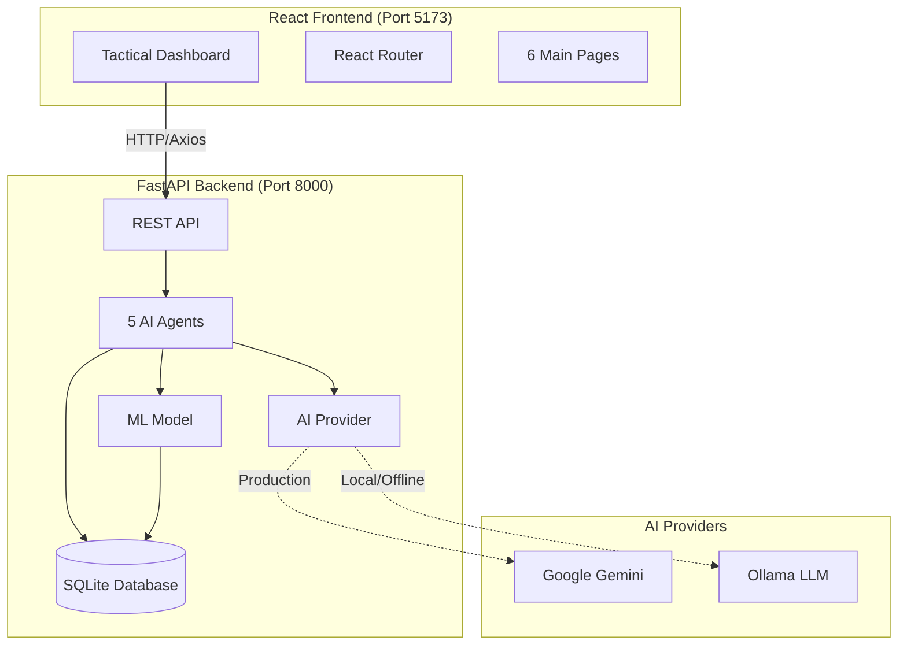
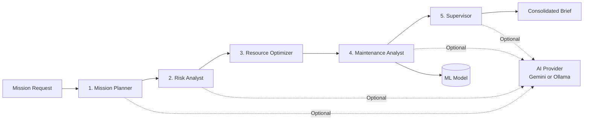
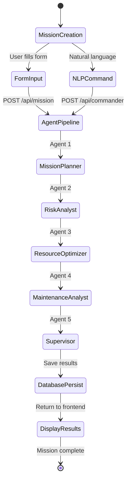
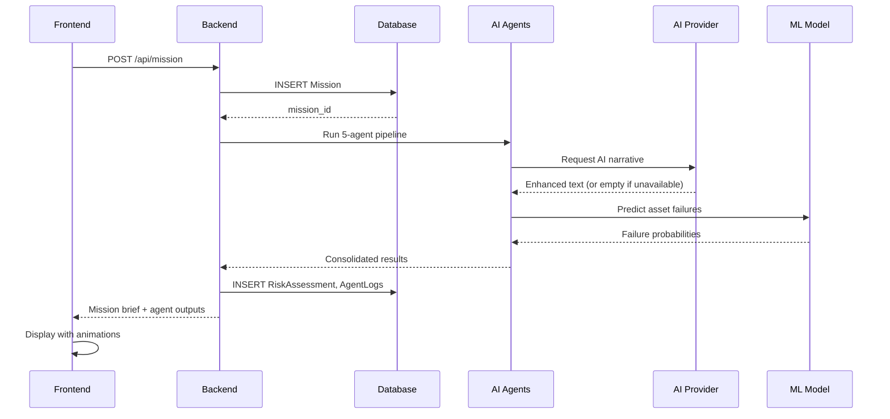

# ANVIKSHAKA-X

**AI-Powered Naval Mission Planning & Risk Assessment System**

A command-and-control platform that combines multiple AI agents, machine learning, and a tactical interface to automate naval mission planning, risk assessment, resource optimization, and predictive maintenance.

## Overview

ANVIKSHAKA-X automates naval mission planning through a multi-agent AI system. Five specialized agents work sequentially to analyze missions, assess risks, optimize resource allocation, and predict equipment failures.

### Core Features

- **Multi-Agent AI Pipeline** — Five agents collaborate to provide comprehensive mission analysis
- **Hybrid AI Support** — Use Gemini (production) or Ollama (local/offline) with automatic fallback
- **Risk Assessment** — Evaluates threats based on weather, duration, and operational factors
- **Predictive Maintenance** — Machine learning-powered failure probability predictions
- **Natural Language Interface** — Parse plain English commands into structured missions
- **Glassmorphism UI** — Modern interface with smooth animations and responsive design

## Architecture

### System Overview



### AI Agent Pipeline

Five specialized agents execute sequentially to analyze each mission:



#### Agent Responsibilities

| Agent | Purpose | Output |
|-------|---------|--------|
| **Mission Planner** | Plans route, strategy, timeline, asset roles | Waypoints, tactical approach, phase timeline |
| **Risk Analyst** | Evaluates threats, weather, duration impact | Risk score (0-100), success probability, high-risk zones |
| **Resource Optimizer** | Allocates assets by battery health & capability | Primary/backup roles, coverage percentage |
| **Maintenance Analyst** | Predicts failures using ML model | Failure probability per asset, risk classification |
| **Supervisor** | Consolidates all outputs into command brief | Final mission brief, contingency plans, alerts |

## Quick Start

### Prerequisites

- Python 3.11+
- Node.js 18+
- **For local/offline mode:** Ollama (optional)
- **For production deployment with AI:** Google Gemini API key (required for hosted AI-powered deployment; optional only if using rule-based fallback)

### Installation

#### 1. Clone Repository

```bash
git clone https://github.com/SaiVarunPappla/ANVIKSHAKA-X.git
cd ANVIKSHAKA-X
```

#### 2. Backend Setup

```bash
cd backend

# Create virtual environment
python -m venv venv
source venv/bin/activate  # Windows: venv\Scripts\activate

# Install dependencies
pip install -r requirements.txt

# Configure AI provider (choose one):
# Option A: Use Gemini (production/online)
export AI_PROVIDER=gemini
export GEMINI_API_KEY=your_api_key_here

# Option B: Use Ollama (local/offline - requires Ollama running)
export AI_PROVIDER=ollama

# Option C: Auto-detect (tries Gemini, then Ollama, then rule-based)
export AI_PROVIDER=auto

# Option D: No AI (rule-based only)
export AI_PROVIDER=rule-based

# Train ML model (first time only)
cd ../ml
python generate_dataset.py
python train_model.py
cd ../backend

# Start backend server
python main.py
```

Backend will run on `http://localhost:8000`

#### 3. Frontend Setup

```bash
cd frontend

# Install dependencies
npm install

# Start development server
npm run dev
```

Frontend will run on `http://localhost:5173`

#### 4. AI Provider Setup

**Option A: Google Gemini (Production/Online)**

1. Get API key from [Google AI Studio](https://makersuite.google.com/app/apikey)
2. Set environment variables:
   ```bash
   export AI_PROVIDER=gemini
   export GEMINI_API_KEY=your_api_key_here
   export GEMINI_MODEL=gemini-1.5-flash  # optional, this is default
   ```

**Option B: Ollama (Local/Offline)**

1. Install Ollama from [ollama.ai](https://ollama.ai)
2. Pull the model: `ollama pull llama3`
3. Set environment variables:
   ```bash
   export AI_PROVIDER=ollama
   export OLLAMA_MODEL=llama3  # optional, this is default
   # For custom Ollama URL: export OLLAMA_HOST=http://custom-host:11434
   ```

**Option C: Auto Mode (Recommended)**

The system automatically selects the best available AI provider:
```bash
export AI_PROVIDER=auto
# If GEMINI_API_KEY is set → uses Gemini
# Else if Ollama is running → uses Ollama
# Else → uses rule-based fallback
```

The system gracefully degrades to rule-based logic if no AI provider is available.

## Tech Stack

### Backend
| Technology | Purpose |
|------------|---------|
| **FastAPI** | High-performance async web framework |
| **SQLAlchemy** | ORM for database operations |
| **SQLite** | Development database (PostgreSQL ready) |
| **Pydantic** | Data validation and settings management |
| **scikit-learn** | ML model training (Random Forest) |
| **pandas/numpy** | Data processing and analysis |
| **Google Gemini** | Cloud AI provider (production) |
| **Ollama** | Local LLM integration (offline mode) |
| **httpx** | Async HTTP client |
| **joblib** | Model persistence |

### Frontend
| Technology | Purpose |
|------------|---------|
| **React 18** | Modern UI library with hooks |
| **Vite** | Build tool |
| **React Router v6** | Client-side routing |
| **Tailwind CSS** | Utility-first CSS framework |
| **Framer Motion** | Animations and transitions |
| **Recharts** | Data visualization charts |
| **Axios** | HTTP client for API calls |
| **Lucide React** | Icon library |

### DevOps
| Tool | Purpose |
|------|---------|
| **uvicorn** | ASGI server for FastAPI |
| **PostCSS** | CSS processing |
| **Autoprefixer** | CSS vendor prefixing |

## Repository Structure

```
anvikshaka-x/
├── backend/                    # FastAPI backend server
│   ├── agents/                 # AI agent implementations
│   │   ├── base_agent.py      # Base class with unified AI provider
│   │   ├── mission_planner.py  # Agent 1: Route & strategy planning
│   │   ├── risk_analyst.py     # Agent 2: Risk assessment
│   │   ├── resource_optimizer.py # Agent 3: Asset allocation
│   │   ├── maintenance_analyst.py # Agent 4: ML predictions
│   │   ├── supervisor.py       # Agent 5: Consolidation
│   │   └── nlp_commander.py    # Natural language parser
│   ├── routers/                # API route handlers
│   │   ├── mission.py          # Mission CRUD + agent pipeline
│   │   ├── risk.py             # Risk analysis endpoints
│   │   ├── maintenance.py      # Maintenance predictions
│   │   ├── dashboard.py        # Dashboard aggregations
│   │   ├── chat.py             # AI chat interface
│   │   └── commander.py        # NLP command parsing
│   ├── ai_provider.py          # Unified AI provider (Gemini/Ollama/Rule-based)
│   ├── main.py                 # FastAPI application entry
│   ├── database.py             # SQLAlchemy setup
│   ├── models.py               # ORM models (5 tables)
│   ├── schemas.py              # Pydantic request/response schemas
│   └── requirements.txt        # Python dependencies
│
├── frontend/                   # React SPA
│   ├── src/
│   │   ├── pages/              # Main application pages
│   │   │   ├── Dashboard.jsx   # KPI overview & recent missions
│   │   │   ├── MissionPlanner.jsx # Mission creation form
│   │   │   ├── RiskDashboard.jsx # Risk analysis results
│   │   │   ├── Maintenance.jsx  # Predictive maintenance
│   │   │   ├── Analytics.jsx    # Fleet analytics charts
│   │   │   └── Chat.jsx         # AI chat interface
│   │   ├── components/         # Reusable components
│   │   │   ├── Sidebar.jsx     # Navigation sidebar
│   │   │   ├── Navbar.jsx      # Page header
│   │   │   ├── KPICard.jsx     # Metric display cards
│   │   │   ├── MissionForm.jsx # Mission input form
│   │   │   ├── RiskPanel.jsx   # Risk visualization
│   │   │   ├── MaintenanceTable.jsx # Prediction table
│   │   │   └── AgentOutputPanel.jsx # Agent results display
│   │   ├── lib/
│   │   │   └── api.js          # Axios API client
│   │   ├── App.jsx             # Root component with routing
│   │   ├── main.jsx            # React entry point
│   │   └── index.css           # Global styles + Tailwind
│   ├── package.json            # Node dependencies
│   ├── vite.config.js          # Vite configuration
│   └── tailwind.config.js      # Tailwind customization
│
├── ml/                         # Machine Learning module
│   ├── data/
│   │   └── synthetic_assets.csv # Training dataset
│   ├── models/
│   │   └── maintenance_model.pkl # Trained Random Forest
│   ├── generate_dataset.py     # Synthetic data generator
│   ├── train_model.py          # Model training script
│   └── predict.py              # Prediction interface
│
└── docs/                       # Documentation
    ├── archive/                # Historical development notes
    └── internal/               # Technical documentation
```

## System Workflow

### Mission Lifecycle



### Data Flow



## Frontend Details

The frontend uses React 18 with Vite, featuring a glassmorphism design system built with Tailwind CSS and Framer Motion animations.

### Key Pages

| Page | Purpose |
|------|---------|
| **Dashboard** | Live KPIs, recent missions, system status |
| **Mission Planner** | Form-based mission creation with asset allocation |
| **Risk Dashboard** | Risk analysis with score cards and zone visualization |
| **Maintenance** | ML-powered failure predictions with risk classification |
| **Analytics** | Fleet health charts and mission success metrics |
| **Chat** | Natural language interface for mission commands |

## API Endpoints

#### Mission Management
```http
POST   /api/mission              # Create mission + run all agents
GET    /api/missions             # List all missions
GET    /api/agent-logs/{id}      # Get agent logs for mission
POST   /api/commander            # Natural language mission creation
```

#### Analysis & Predictions
```http
POST   /api/risk-analysis        # Analyze risk for specific mission
POST   /api/maintenance          # Run ML predictions for assets
GET    /api/assets               # List all assets
```

#### Dashboard & Monitoring
```http
GET    /api/dashboard            # Aggregated KPIs and stats
POST   /api/chat                 # Chat with AI assistant
GET    /api/health               # System health check
```

### Database Schema

```sql
-- Mission: stores every mission submitted
missions (
    id, name, mission_type, duration_hours,
    threat_level, weather, num_drones, num_auvs,
    num_torpedoes, num_launchers, status, created_at
)

-- Asset: drones, AUVs, torpedoes, launchers
assets (
    id, name, asset_type, battery_health,
    operating_hours, mission_count, status, last_maintenance
)

-- RiskAssessment: risk analysis results per mission
risk_assessments (
    id, mission_id, risk_score, risk_category,
    success_probability, high_risk_zones,
    route_suggestion, agent_output_json, created_at
)

-- MaintenancePrediction: ML predictions per asset
maintenance_predictions (
    id, asset_id, failure_probability, risk_level,
    recommended_action, predicted_at
)

-- AgentLog: audit trail of agent invocations
agent_logs (
    id, mission_id, agent_name, input_summary,
    output_json, created_at
)
```

### Machine Learning

The system uses a Random Forest Classifier trained on 7 features to predict asset failure probability:

```python
# Features used for prediction
features = [
    "battery_health",      # 0-100 percentage
    "operating_hours",     # Total hours in operation
    "mission_count",       # Number of missions completed
    "temperature",         # Operating temperature (°C)
    "humidity",            # Environmental humidity (%)
    "vibration_level",     # Vibration sensor reading
    "pressure"             # Atmospheric pressure (atm)
]

# Output: Failure probability (0.0 - 1.0)
# Risk classification: low / medium / high / critical
```

Training details:
- 1000 synthetic asset samples
- 80/20 train-test split
- Persisted with joblib
- Graceful fallback to heuristics if model unavailable

## Configuration

The system supports hybrid AI deployment with multiple providers:

### AI Provider Configuration

Environment variables:

```bash
# AI Provider Selection
AI_PROVIDER=auto  # Options: "gemini", "ollama", "auto", "rule-based"

# Gemini Configuration (production/hosted)
GEMINI_API_KEY=your_api_key_here
GEMINI_MODEL=gemini-1.5-flash

# Ollama Configuration (local/offline)
# The ollama-python library uses OLLAMA_HOST for server connection
OLLAMA_HOST=http://localhost:11434  # Set to custom URL if needed
OLLAMA_MODEL=llama3

# Database
DATABASE_URL=sqlite:///./anvikshaka.db

# API
API_HOST=0.0.0.0
API_PORT=8000

# Logging
LOG_LEVEL=INFO
```

### AI Provider Selection Logic

| Mode | Behavior |
|------|----------|
| **auto** (recommended) | 1. Use Gemini if `GEMINI_API_KEY` is set<br>2. Else use Ollama if server is running<br>3. Else use rule-based fallback |
| **gemini** | Use Google Gemini API (requires API key) |
| **ollama** | Use local Ollama server (requires Ollama running) |
| **rule-based** | Disable AI completely, use rule-based logic only |

### Environment Files

**Local Development - Backend** (`.env` in `backend/` directory):
```bash
AI_PROVIDER=gemini
GEMINI_API_KEY=your_key

# Optional: Enable database seeding on startup
SEED_DATABASE=true
```

**Local Development - Frontend** (`.env` in `frontend/` directory):
```bash
VITE_API_URL=http://localhost:8000/api
```

**Production on Vercel:**

All production environment variables must be set in the **Vercel Project Dashboard** under Settings → Environment Variables:

- `AI_PROVIDER=gemini` (required)
- `GEMINI_API_KEY=<your_actual_key>` (required)
- `SEED_DATABASE=false` (recommended)

Frontend automatically uses `/api` endpoint via Vercel routing. No `.env.production` file is needed.

## Deployment

### Vercel Deployment (Recommended)

ANVIKSHAKA-X is configured for seamless deployment on Vercel with Gemini AI:

#### 1. Prerequisites

- Vercel account
- Google Gemini API key ([Get one here](https://makersuite.google.com/app/apikey))
- GitHub repository connected to Vercel

#### 2. Deploy to Vercel

**Via Vercel Dashboard:**
1. Go to [vercel.com](https://vercel.com) and import your GitHub repository
2. Framework Preset: **Other** (auto-detected)
3. Build settings are handled by `vercel.json`
4. Go to Project Settings → Environment Variables and add:
   - `AI_PROVIDER` = `gemini`
   - `GEMINI_API_KEY` = `<your_key_from_google_ai_studio>`
   - `SEED_DATABASE` = `false`
5. Deploy

**Via CLI:**
```bash
npm install -g vercel
vercel
```

Then set environment variables in Vercel dashboard under Project Settings → Environment Variables.

The deployment automatically:
- Builds the React frontend with Vite
- Deploys the FastAPI backend as serverless functions
- Routes `/api/*` requests to the backend
- Serves frontend static files from root
- Handles SPA routing (page refresh works correctly on all routes)

### Alternative: Docker Deployment

For self-hosted deployments with Ollama:

```dockerfile
FROM python:3.11-slim

WORKDIR /app
COPY backend/requirements.txt .
RUN pip install --no-cache-dir -r requirements.txt

COPY backend/ .
COPY ml/ ../ml/

# Set to use Ollama (requires separate Ollama container)
ENV AI_PROVIDER=ollama
ENV OLLAMA_HOST=http://ollama:11434

EXPOSE 8000
CMD ["uvicorn", "main:app", "--host", "0.0.0.0", "--port", "8000"]
```

Docker Compose with Ollama:

```yaml
version: '3.8'
services:
  backend:
    build: .
    ports:
      - "8000:8000"
    environment:
      - AI_PROVIDER=ollama
      - OLLAMA_HOST=http://ollama:11434
    depends_on:
      - ollama
  
  ollama:
    image: ollama/ollama
    ports:
      - "11434:11434"
    volumes:
      - ollama_data:/root/.ollama
  
  frontend:
    image: node:18
    working_dir: /app
    volumes:
      - ./frontend:/app
    ports:
      - "5173:5173"
    command: sh -c "npm install && npm run dev"
    environment:
      - VITE_API_URL=http://localhost:8000/api

volumes:
  ollama_data:
```

### Hybrid Deployment Strategy

**Production (Online):**
- Deploy to Vercel
- Use Gemini AI (`AI_PROVIDER=gemini`)
- Set `GEMINI_API_KEY` in Vercel environment variables
- Database: PostgreSQL (upgrade from SQLite)

**Development (Local):**
- Run locally with `python main.py`
- Use Ollama (`AI_PROVIDER=ollama`) or auto mode
- SQLite database for quick iteration

**Offline/Air-gapped:**
- Deploy via Docker
- Use Ollama in offline mode
- No external API calls required

### Production Recommendations

- Switch to PostgreSQL from SQLite for Vercel deployment
- Monitor API key usage (Gemini has rate limits)
- Set up health check monitoring (`/api/health` endpoint)
- Enable logging to external service (e.g., Datadog, Sentry)
- Use Vercel environment variables for secrets management

## Known Limitations

| Issue | Impact | Workaround |
|-------|--------|------------|
| **Dashboard connection beams** misaligned on mobile | Cosmetic | Beams work correctly on desktop (1024px+) |
| **SQLite concurrent writes** limited | Development only | Use PostgreSQL in production |
| **Gemini cold start** Minimal | First API call ~200-800ms | Normal for cloud APIs |
| **Ollama cold start** 5-10 seconds | First LLM call in local mode | Keep Ollama running |
| **ML model requires training** | First-time setup | Run training scripts once |
| **No real-time updates** | Manual refresh needed | Future WebSocket implementation |

## Future Improvements

Planned features:

- Real-time mission tracking via WebSockets
- Multi-user collaboration with role-based access
- Mission replay and simulation mode
- Enhanced ML models for better predictions
- Export mission briefs to PDF/JSON
- Map integration for route visualization
- Historical trend analysis
- Mobile-responsive optimizations
- Offline mode with service workers
- Custom agent configurations

Technical priorities:

- Migrate to PostgreSQL
- Add test coverage (unit + integration)
- Implement authentication/authorization
- Add API rate limiting
- Set up CI/CD pipeline
- Add Swagger/OpenAPI documentation
- Implement caching with Redis

## Contributing

Contributions are welcome. Please follow these guidelines:

### Development Workflow

1. Fork the repository
2. Create a feature branch: `git checkout -b feature/your-feature-name`
3. Make your changes following existing code style
4. Test your changes across backend, frontend, and ML components
5. Commit with clear messages: `git commit -m "feat: add new feature"`
6. Push and create a Pull Request

### Code Style

**Python (Backend):**
- Follow PEP 8 guidelines
- Use type hints where appropriate
- Add docstrings to classes and functions
- Keep functions focused and single-purpose

**JavaScript (Frontend):**
- Use functional components with hooks
- Follow React best practices
- Use destructuring for props
- Keep components under 200 lines when possible

## License

This project is licensed under the MIT License. See the [LICENSE](LICENSE) file for details.

## Acknowledgments

- FastAPI for the async web framework
- React Team for the UI library
- Ollama for making local LLMs accessible
- scikit-learn for ML tools
- Tailwind CSS for the utility-first framework
- Framer Motion for animation capabilities

## Contact

- Issues: [GitHub Issues](https://github.com/SaiVarunPappla/ANVIKSHAKA-X/issues)
- Discussions: [GitHub Discussions](https://github.com/SaiVarunPappla/ANVIKSHAKA-X/discussions)
